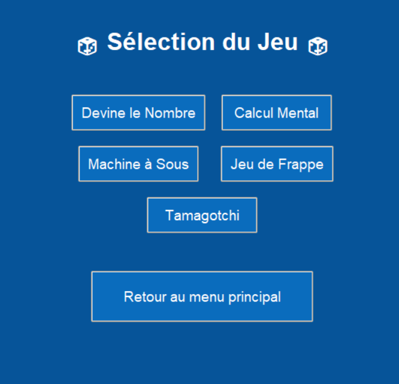

# Mini-Jeux

## Description
Mini-Jeux est une application ludique qui propose une petite variété de jeux interactifss. Ce projet a été réalisé dans le cadre d'un projet personnel pour explorer le développement de jeux en Python.

## Image d'aperçu


## Contexte et Objectif
- **Contexte :** Projet personnel visant à créer une plateforme de jeux.
- **Objectif :** Développer une application python de zéro pour explorer de nouvelles façon d'utiliser python.

## Fonctionnalités Principales
- **Jeux variés :** Une collection de jeux : Devine le nombre, Calcul mentale, Machine à sous, Jeu de frappe, Tamagochi.
- **Scores et classements :** Système de scores pour encourager la compétition amicale entre les utilisateurs.

## Compétences et Outils Utilisés
- **Langages :** Python, avec des bibliothèques comme Pygame pour le développement de jeux.
- **Outils :** GitHub pour le contrôle de version.
- **Compétences développées :** Programmation orientée objet, gestion des événements, et optimisation des performances de jeu.

## Installation
Pour exécuter Mini-Jeux sur votre machine, suivez ces étapes :
1. Clonez le dépôt :
   ```bash
   git clone https://github.com/OIILury/Mini-Jeux.git
   ```
2. Accédez au répertoire du projet :
   ```bash
   cd Mini-Jeux
   ```
3. Installez les dépendances nécessaires :
   ```bash
   pip install -r requirements.txt
   ```
4. Lancez l'application :
   ```bash
   python main.py
   ```

## Auteurs
  [OIILury](https://github.com/OIILury)
